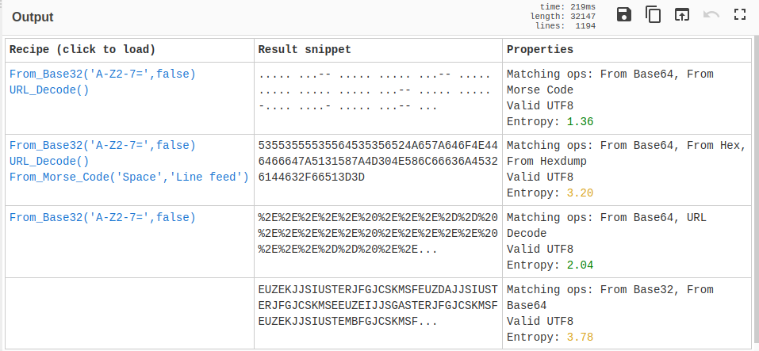
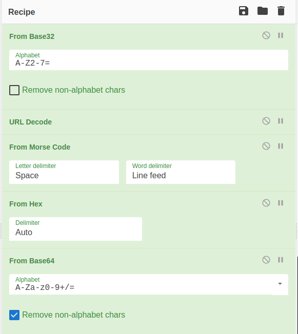

# Encoding

## Category

Warmup

## Tools Used

CyberChef

## Key Takeaways

- Cyberchef is a fantastic tool for dealing with cryptographic problems

## Question

I have no idea what this message means, can you help me decipher it? 👨‍💻 

_enc.txt_ is provided.

## Process

After downloading enc.txt, we are met with the following bit of...text?

```EUZEKJJSIUSTERJFGJCSKMSFEUZDAJJSIUSTERJFGJCSKMSEEUZEIJJSGASTERJFGJCSKMSFEUZEKJJSIUSTEMBFGJCSKMSFEUZEKJJSIUSTERJFGIYCKMSFEUZEKJJSIUSTERBFGJCCKMRQEUZEKJJSIUSTERJFGJCSKMSFEUZDAJJSIUSTERJFGJCSKMSFEUZEKJJSGASTERJFGJCSKMSFEUZEKJJSIUSTEMBFGJCSKMSFEUZEKJJSIUSTERJFGIYCKMSFEUZEKJJSIUSTERBFGJCCKMRQEUZEKJJSIUSTERJFGJCSKMSFEUZDAJJSIUSTERJFGJCSKMSFEUZEKJJSGASTERBFGJCSKMSFEUZEKJJSIUSTEMBFGJCSKMSFEUZEKJJSIUSTERBFGIYCKMSFEUZEKJJSIUSTERJFGJCSKMRQEUZEKJJSIUSTERJFGJCCKMSEEUZDAJJSIUSTERJFGJCSKMSFEUZEKJJSGASTERJFGJCSKMSFEUZEIJJSIQSTEMBFGJCSKMSFEUZEKJJSIUSTERJFGIYCKMSEEUZEKJJSIUSTERJFGJCSKMRQEUZEKJJSIUSTERJFGJCSKMSFEUZDAJJSIUSTERJFGJCCKMSEEUZEIJJSGASTERJFGJCSKMSFEUZEKJJSIQSTEMBFGJCSKMSEEUZDAJJSIQSTERJFGJCSKMSFEUZEKJJSGASTERJFGJCSKMSFEUZEKJJSIUSTEMBFGJCCKMSEEUZEKJJSIUSTERJFGIYCKMSFEUZEIJJSGASTERBFGJCSKMSFEUZEKJJSIUSTEMBFGJCSKMSFEUZEKJJSIUSTERBFGIYCKMSEEUZEKJJSIUSTERJFGJCSKMRQEUZEKJJSIUSTERBFGJCSKMRQEUZEKJJSIUSTERJFGJCSKMSEEUZDAJJSIUSTEMBFGJCSKMSFEUZEKJJSIUSTERBFGIYCKMSFEUZEKJJSIUSTERJFGJCCKMRQEUZEIJJSIUSTERJFGJCSKMSFEUZDAJJSIUSTERJFGJCSKMSFEUZEIJJSGASTERBFGJCSKMSFEUZEKJJSIUSTEMBFGJCCKMSFEUZEKJJSIUSTERJFGIYCKMSEEUZEKJJSIUSTERJFGJCSKMRQEUZEKJJSIUSTERJFGJCSKMSEEUZDAJJSIQSTERBFGJCSKMSFEUZEKJJSGASTERJFGJCCKMRQEUZEKJJSIUSTERJFGJCSKMSFEUZDAJJSIUSTERBFGJCCKMSEEUZEIJJSGASTERJFGJCSKMSFEUZEIJJSIQSTEMBFGJCSKMSEEUZEIJJSIQSTERBFGIYCKMSFEUZEKJJSIUSTERJFGJCSKMRQEUZEIJJSIQSTERBFGJCSKMSFEUZDAJJSIQSTERBFGJCSKMSFEUZEKJJSGASTERJFGJCCKMRQEUZEKJJSIUSTERJFGJCSKMSEEUZDAJJSIQSTERJFGJCSKMRQEUZEKJJSIUSTERJFGJCCKMSEEUZDAJJSIQSTERBFGJCCKMSEEUZEIJJSGASTERJFGJCSKMSFEUZEKJJSIQSTEMBFGJCSKMRQEUZEKJJSIUSTERJFGJCSKMSFEUZDAJJSIQSTERBFGJCCKMSFEUZEKJJSGASTERBFGJCSKMSFEUZEKJJSIUSTEMBFGJCCKMSFEUZEIJJSIUSTEMBFGJCCKMSFEUZEKJJSIUSTERJFGIYCKMSEEUZEKJJSIUSTERJFGJCSKMRQEUZEIJJSIUSTERJFGJCSKMSFEUZDAJJSIUSTERJFGJCSKMSEEUZEIJJSGASTERBFGJCSKMSFEUZEKJJSIUSTEMBFGJCSKMSEEUZDAJJSIUSTERJFGJCSKMSFEUZEIJJSGASTERJFGJCSKMSFEUZEKJJSIUSTEMBFGJCSKMSFEUZEKJJSIQSTERBFGIYCKMSFEUZEKJJSIQSTERBFGJCCKMRQEUZEIJJSIUSTERJFGJCSKMSFEUZDAJJSIUSTERBFGJCCKMSEEUZEIJJSGASTERJFGJCSKMSFEUZEKJJSIQSTEMBFGJCSKMSFEUZEKJJSIUSTERBFGIYCKMSEEUZEKJJSIUSTERJFGJCSKMRQEUZEKJJSIUSTERJFGJCCKMSEEUZDAJJSIUSTERJFGJCCKMSEEUZEIJJSGASTERJFGJCSKMSEEUZEKJJSGASTERBFGJCSKMSFEUZEKJJSIUSTEMBFGJCCKMSFEUZEKJJSIUSTERJFGIYCKMSFEUZEKJJSIUSTERJFGJCSKMRQEUZEKJJSIQSTERBFGJCCKMSEEUZDAJJSIUSTERJFGJCSKMSEEUZEIJJSGASTERBFGJCSKMSFEUZDAJJSIUSTERJFGJCSKMSEEUZEIJJSGASTERBFGJCSKMSF%```

While this is certainly illegible, there is a fantastic tool to help us make things less illegible and quite possibly even legible: [Cyberchef.io](https://cyberchef.io)!


As we place our mysterious text into the _Input_ section, we see it is replicated in the output section. This seems about right, seeing as we have not added any "recipes" to change the input.

A good first place to start when dealing with any unknown value is to try the _Magic_ Operation, which will attempt to automatically discern anything from the provided text. Luckily for us, we get a hit!



With our first result being a translation of our text into morse code and our second being that deciphering of the morse code itself, we can click on the second result and are left with the following message: `53553555535564535356524A657A646F4E446466647A5131587A4D304E586C66636A45326144632F66513D3D`

From here, there are a lot of things that we can experiment with to move towards the answer, but a keen eye may spot that each value in the above text falls neatly into the category of being either a number or the letters A through F. As such, this seems like it could quite possibly be a hex value. As luck would have it, adding the `From Hex` value leaves us with a very recognizable string: `SU5USUdSSVRJezdoNDdfdzQ1XzM0NXlfcjE2aDc/fQ==`.

The _==_ at the end of this string are very indicative of a certain type of encoding: Base64. So, by adding our final value to the recipe of `From Base64`, we are giving the flag of `INTIGRITI{7h47_w45_345y_r16h7?}`


